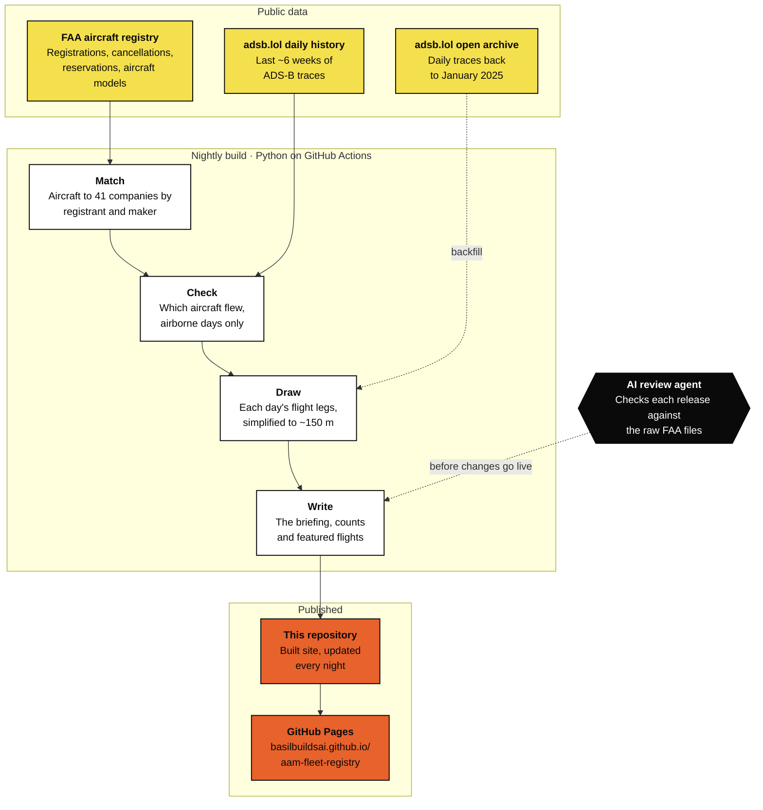

# AAM Fleet Registry

A live tracker of the aircraft that advanced air mobility companies hold on the FAA registry, the N-numbers they have reserved, and where those aircraft have flown.

**Live site** https://basilbuildsai.github.io/aam-fleet-registry/

This repository holds the published website. It is rebuilt every night from public FAA and ADS-B data. The source code is private for now.

## What it shows

- **Registered aircraft.** Every aircraft that 41 eVTOL, eSTOL and hybrid electric companies hold on the U.S. civil aircraft registry, including Joby, BETA, Archer, Wisk, Elroy Air, Electra, Rotor and others. Each N-number links to its FAA record.
- **Own designs and support fleets.** Aircraft each company designed itself are counted separately from the chase planes, trainers and test conversions it owns.
- **Reserved N-numbers.** Registrations held for aircraft that have not been registered yet.
- **Who is flying.** Which aircraft were seen airborne on public ADS-B in the last 45 days, with replay links to adsb.lol and ADS-B Exchange.
- **Where they fly.** A flight map drawn like a site plan, with Alaska and Hawaii insets and two close-ups of the busiest test areas, Monterey Bay and Salinas for Joby and Archer, and Lake Champlain for BETA.
- **Flights abroad.** A world map and regional maps for the same aircraft flying outside North America, so far in Europe, New Zealand, Japan and the United Arab Emirates.
- **Featured flights.** Notable trips stay on the map permanently. These include Joby's autonomous Cessna Caravan (N101XW) flying coast to coast and back in September 2026, and BETA's all-electric CX300 (N401NZ) flying the Surf Air trial in Hawaii in June and July 2026, then touring the western and southern U.S. since early August.
- **Latest from the registry and the radar.** A short briefing written by each night's build, covering new registration certificates, reservations and the week's flying.
- **A manufacturer directory** covering U.S. and international programs, including those with no U.S. registrations.

## How it works

1. Each night the build downloads the FAA Releasable Aircraft Database, with its current registrations, cancellations, reservations and aircraft models.
2. It matches aircraft to companies by registrant and by the maker listed in the FAA model table. Unrelated companies that share a name were removed by hand.
3. It checks adsb.lol's public daily history for every registered aircraft. A day counts as seen only when the aircraft reported airborne positions. Flights older than the live history, back to January 2025, come from adsb.lol's open daily archive.
4. It draws each day's airborne legs on the map, simplified to about 150 m (500 ft).
5. GitHub Actions publishes the result here, and GitHub Pages serves it.

An independent AI review agent checked each release against the raw FAA files before it went live.

## About ADS-B coverage and privacy

Aircraft appear on the map only while their transponder is on and a volunteer receiver is in range. Coverage is thin over rural areas, so recorded distances run under the real route, and test aircraft that fly with ADS-B off or under a privacy address will not show up.

Some owners ask the FAA to limit tracking of their aircraft through the LADD program. LADD asks commercial services such as FlightAware and Flightradar24 to hide those aircraft. It does not change what an aircraft broadcasts, so aircraft flying on their registered ADS-B code still appear in volunteer networks like adsb.lol, which is where this site's flight data comes from.

## Data and credits

| Source | Used for |
|---|---|
| [FAA Releasable Aircraft Database](https://www.faa.gov/licenses_certificates/aircraft_certification/aircraft_registry/releasable_aircraft_download) | Registrations, cancellations, reservations and aircraft models |
| [adsb.lol](https://adsb.lol) | Public ADS-B flight history |
| [Esri World Imagery](https://www.arcgis.com/home/item.html?id=10df2279f9684e4a9f6a7f08febac2a9) | Map imagery (Esri, Maxar, Earthstar Geographics) |
| [us-atlas](https://github.com/topojson/us-atlas) | U.S. outline, based on U.S. Census Bureau data |
| [OurAirports](https://ourairports.com/data/) | Airport names and positions for featured flight stops |
| [Leaflet](https://leafletjs.com) | Interactive maps |

Company status notes reflect public reporting and are reviewed by hand.

## Built by

Basil Yap. Accelerating autonomy and AI in aviation. First U.S. BVLOS waiver without visual observers. Private Pilot, Part 107.

Corrections and questions are welcome on [LinkedIn](https://www.linkedin.com/in/basil-yap-461b1975/).
